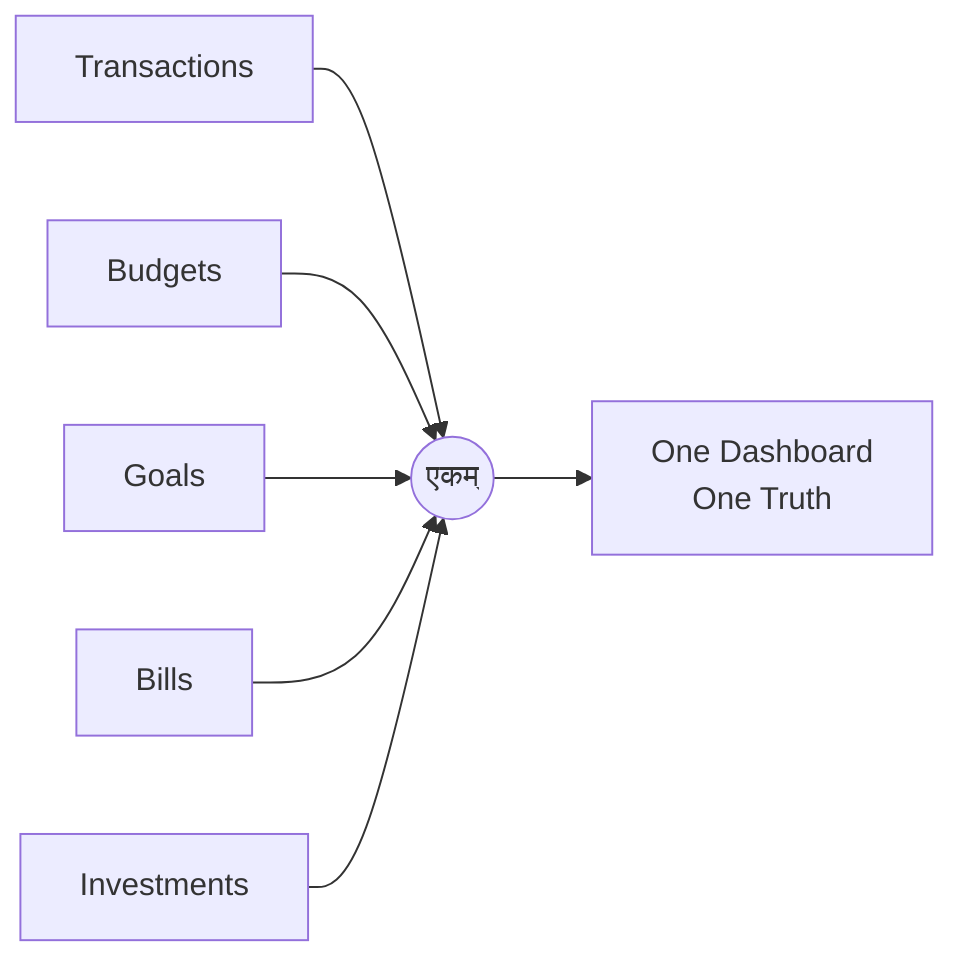

<h1 align="center">एकम्</h1>
<h3 align="center">EKAM FINANCE</h3>
<p align="center"><i>"The One."</i> One place for every rupee: budgets, bills, goals, and investments, built for how Indians actually manage money.</p>

<p align="center">
  
  
  
  
  
</p>

<p align="center">
  
</p>

---

### THE PREMISE

Most budgeting apps are American software with a rupee symbol swapped in. Ekam Finance isn't that. It's built INR first, for the way money actually moves in an Indian household: transactions, budgets, bills, goals, and investments, all reporting to one dial instead of five disconnected apps.

एकम्, *ekam*, "the one," is the idea in one word. Everything your money does, converging on a single, honest number.



---

### WHAT'S ON THE DIAL

| Module | What it does |
|---|---|
| **Dashboard** | Net worth, spend trends, and account balances, at a glance |
| **Transactions** | Categorized income and expense tracking with stable, predictable sort ordering |
| **Accounts** | Multi-account support (bank, cash, wallet) with server-side balance guards |
| **Budgets** | Category-wise monthly budgets with live progress tracking |
| **Goals** | Savings goals with target dates and contribution tracking |
| **Bills** | Recurring bill reminders, so nothing quietly lapses |
| **Investments** | Holdings and portfolio value, tracked over time |
| **Reports** | Rich, exportable breakdowns of spending and income by category or time |

---

### HOW IT STAYS HONEST

The dial only means something if the number underneath it can be trusted. A few decisions exist specifically for that.

Data integrity is enforced below the UI. Mandatory fields, server-side balance guards, and stable sort ordering live at the database and server-action layer, not just on-screen validation a client could skip.

Supabase queries use `.maybeSingle()` over `.single()`, since a zero-row result is a normal outcome here, not an exception to throw.

Partial unique indexes close the gap where Postgres's default uniqueness behavior would otherwise let NULL-backed duplicates slip through.

Route groups, `(auth)` and `(dashboard)`, keep authenticated and public flows cleanly separated at the App Router level, so there's no ambiguity about what needs a session.

---

### STRUCTURE

```
app/
├── (auth)/              # Login, signup, auth flows
├── (dashboard)/
│   └── dashboard/
│       ├── accounts/
│       ├── bills/
│       ├── budget/
│       ├── goals/
│       ├── investments/
│       ├── reports/
│       ├── settings/
│       └── transactions/
├── actions/             # Server actions
├── auth/                # Auth route handlers
└── page.tsx             # Landing page
components/
lib/
types/
middleware.ts            # Session/auth middleware
```

---

### GROUND SYSTEMS

- **Framework:** Next.js 15 (App Router, Server Components by default)
- **Language:** TypeScript, strict mode
- **Backend:** Supabase, PostgreSQL, Auth, and Row-Level Security
- **Styling:** Tailwind CSS v3
- **State:** Zustand
- **Validation:** Zod
- **Charts:** Recharts
- **Deployment:** Vercel

---

### GETTING STARTED

```bash
git clone https://github.com/sbktckp/ekam-finance.git
cd ekam-finance
npm install
cp .env.example .env.local
# fill in your Supabase project URL and anon key
npm run dev
```

Open [http://localhost:3000](http://localhost:3000).

---

### WHAT'S NEXT

- [ ] Bank statement import (CSV/PDF parsing)
- [ ] Multi-currency support for NRIs
- [ ] Shared/family budgets
- [ ] Mobile app (React Native)

---

<p align="center">Built by <a href="https://github.com/sbktckp">Smit</a>, mentored by <a href="https://linkedin.com/in/pakshal-tated-706155318/">Pakshal Tated</a>.</p>