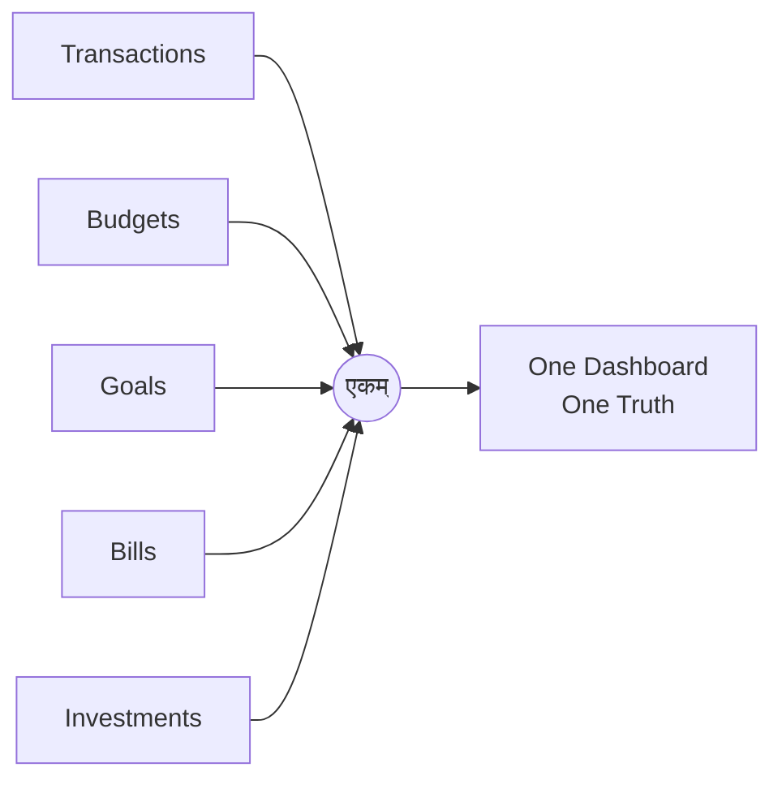

<h1 align="center">एकम्</h1>
<h3 align="center">EKAM FINANCE</h3>
<p align="center"><i>"The One."</i> One place for every rupee: budgets, bills, goals, and investments, built for how Indians actually manage money.</p>

<p align="center">
  
  
  
  
  
  
</p>

<p align="center"><a href="https://ekam-finance.vercel.app"><b>ekam-finance.vercel.app</b></a></p>

---

### THE PREMISE

Most budgeting apps are American software with a rupee symbol swapped in. Ekam Finance isn't that. It's built INR first, for the way money actually moves in an Indian household: transactions, budgets, bills, goals, and investments, all reporting to one dial instead of five disconnected apps.

एकम्, *ekam*, "the one," is the idea in one word. Everything your money does, converging on a single, honest number.



The landing page is a scroll-driven Three.js particle morph: chaos resolving into a rupee sign, then an arrow, then a wallet, then the logo. Emerald and gold on black. It is the same argument the app makes, made before you sign in.

---

### WHAT'S ON THE DIAL

| Module | What it does |
|---|---|
| **Dashboard** | Net worth, spend trends, and account balances, at a glance |
| **Transactions** | Categorized income and expense tracking, split Merchant and Note fields, editable for both types, stable sort ordering |
| **Accounts** | Multi-account support (bank, cash, wallet) with server-side balance guards, plus inter-account transfers with atomic balance syncing |
| **Budgets** | Category-wise monthly budgets with live progress tracking |
| **Goals** | Savings goals with target dates and contribution tracking |
| **Bills** | Recurring bill reminders, so nothing quietly lapses |
| **Investments** | Holdings and portfolio value, tracked over time |
| **Reports** | Six month switcher, calendar heatmap with click-to-expand day drawers, clickable bars and table rows, category colors, income dots, and the coach layer |

The whole dashboard runs a dark theme through a single `.dk` cascade class, so the palette lives in one place rather than scattered across components.

---

### THE COACH LAYER

Reports carries a coach that explains what the numbers are doing, in two parts that fail independently.

`lib/insights.ts` is a deterministic engine. Given the transactions, it produces the observations no model is needed for: what moved, by how much, against what. It always runs.

`app/actions/coach.ts` takes those observations and asks Claude to write the narrative around them, cached once per day in the `ai_insights` table. It needs `ANTHROPIC_API_KEY` set. Without the key the panel degrades to the deterministic output rather than breaking, which is the point of splitting them.

`reports/coach-panel.tsx` renders whichever of the two came back.

---

### HOW IT STAYS HONEST

The dial only means something if the number underneath it can be trusted. A few decisions exist specifically for that.

**`accounts.balance` is the source of truth, not the transaction ledger.** Cash withdrawals are never recorded as transfers, so summing the ledger undercounts. The balance column is what gets read.

**Balance syncing lives in application code, not a database trigger.** `app/actions/transactions.ts` and `app/actions/transfers.ts` keep `accounts.balance` in step. Adding a Postgres trigger on top of this would double count every write, which is worth knowing before anyone tries to "fix" it.

Data integrity is otherwise enforced below the UI. Mandatory fields, server-side balance guards, and stable sort ordering live at the database and server-action layer, not just on-screen validation a client could skip.

Supabase queries use `.maybeSingle()` over `.single()`, since a zero-row result is a normal outcome here, not an exception to throw.

Partial unique indexes close the gap where Postgres's default uniqueness behavior would otherwise let NULL-backed duplicates slip through.

Route groups, `(auth)` and `(dashboard)`, keep authenticated and public flows cleanly separated at the App Router level, so there's no ambiguity about what needs a session.

---

### STRUCTURE

```
app/
├── (auth)/              # Login, signup, auth flows
├── (dashboard)/
│   └── dashboard/
│       ├── accounts/
│       ├── bills/
│       ├── budget/
│       ├── goals/
│       ├── investments/
│       ├── reports/     # heatmap, six month switcher, coach-panel
│       ├── settings/
│       └── transactions/
├── actions/             # accounts, bills, budgets, coach, goals,
│                        # investments, transactions, transfers
├── auth/                # Auth route handlers
└── page.tsx             # Three.js landing journey
components/
lib/
├── insights.ts          # deterministic insight engine
├── constants.ts / utils.ts
└── supabase/            # browser and server clients
types/
middleware.ts            # Session/auth middleware
```

---

### GROUND SYSTEMS

- **Framework:** Next.js 15 (App Router, Server Components by default), React 19
- **Language:** TypeScript, strict mode
- **Backend:** Supabase, PostgreSQL, Auth, and Row-Level Security
- **Styling:** Tailwind CSS v3
- **State:** Zustand
- **Validation:** Zod
- **Charts:** Recharts
- **Motion:** Three.js, GSAP, Lenis
- **Deployment:** Vercel

---

### GETTING STARTED

```bash
git clone https://github.com/sbktckp/ekam-finance.git
cd ekam-finance
npm install
cp .env.example .env.local
# fill in your Supabase project URL and anon key
# optional: ANTHROPIC_API_KEY, for the coach narrative
npm run dev
```

Open [http://localhost:3000](http://localhost:3000).

---

### WHAT'S NEXT

- [ ] Bank statement import (CSV/PDF parsing)
- [ ] Multi-currency support for NRIs
- [ ] Shared/family budgets
- [ ] Mobile app (React Native)

---

<p align="center">Built by <a href="https://github.com/sbktckp">Smit</a>, mentored by <a href="https://linkedin.com/in/pakshal-tated-706155318/">Pakshal Tated</a>.</p>
